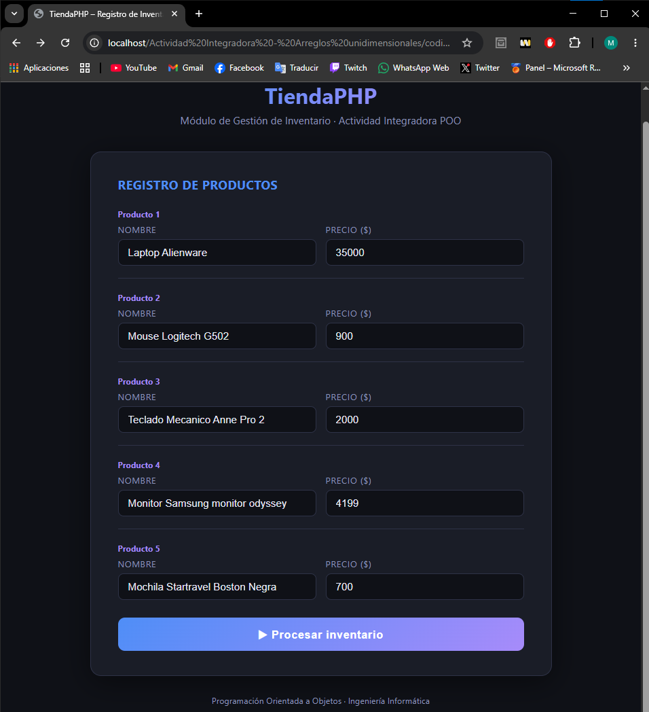

# TiendaPHP — Gestor de Inventario con Arreglos Unidimensionales

> **Asignatura:** Programación Orientada a Objetos  
> **Instituto:** Instituto Tecnológico Superior de Lerdo  
> **Carrera:** Ingeniería Informática  
> **Tipo de actividad:** Actividad Integradora – Arreglos Unidimensionales

---

## 1. Nombre del Proyecto

**TiendaPHP — Módulo de Gestión de Inventario con Arreglos Unidimensionales en PHP**

---

## 2. Objetivo del Proyecto

Aplicar el uso de **arreglos unidimensionales paralelos** en PHP para capturar, almacenar, procesar y analizar información de productos de una tienda en línea. El sistema calcula estadísticas clave del inventario (total, promedio, precio máximo y mínimo) usando funciones nativas de PHP como `array_sum()`, `max()`, `min()` y `array_search()`, presentando los resultados con una interfaz HTML clara y estructurada.

---

## 3. Problema que Resuelve

Una tienda en línea necesita un módulo para gestionar el inventario de sus productos. El dueño requiere saber:

- Cuánto vale el inventario completo en total.
- Cuál es el precio promedio de sus productos.
- Cuál es el producto más caro y cuál el más barato.

El sistema resuelve esto a través de un flujo de tres páginas: el formulario de captura (`index.php`), el procesador lógico (`procesar.php`) y la página de resultados (`resultados.php`), comunicadas mediante variables de sesión y redireccionamientos seguros.

---

## 4. Tecnologías Utilizadas

| Tecnología | Versión recomendada | Rol |
|---|---|---|
| PHP | 8.x | Lógica de procesamiento y cálculos |
| HTML5 | — | Estructura del formulario y resultados |
| CSS3 | — | Estilos visuales integrados en cada página |
| Sesiones PHP (`$_SESSION`) | — | Comunicación de datos entre páginas |
| XAMPP | Cualquier versión reciente | Servidor local (Apache + PHP) |
| Apache | Incluido en XAMPP | Servidor web |
| Navegador web | Chrome / Firefox | Interacción con el sistema |

---

## 5. Conceptos Aplicados

| Concepto | Dónde se aplica |
|---|---|
| **Arreglos unidimensionales** | `$productos[]` y `$precios[]` almacenan los datos en `procesar.php` |
| **Arreglos paralelos** | Ambos arreglos se llenan en sincronía dentro del mismo bloque condicional, garantizando que el índice `$i` siempre corresponda al mismo producto en los dos arreglos |
| **Arreglos desde formulario HTML** | `name="nombre[]"` y `name="precio[]"` hacen que PHP reciba los campos como arreglos automáticamente via `$_POST` |
| **`array_sum()`** | Suma todos los precios en una sola instrucción para obtener el total del inventario |
| **`max()` y `min()`** | Obtienen el precio más alto y más bajo del arreglo `$precios[]` |
| **`array_search()`** | Encuentra el índice del precio máximo/mínimo para recuperar el nombre del producto correspondiente en el arreglo paralelo |
| **`count()`** | Cuenta cuántos productos válidos fueron ingresados para calcular el promedio |
| **`floatval()` y `htmlspecialchars()`** | Conversión y saneamiento de los datos recibidos por POST antes de procesarlos |
| **Sesiones PHP** | `session_start()`, `$_SESSION` y `unset()` transfieren los resultados de `procesar.php` a `resultados.php` de forma segura |
| **Validación en dos capas** | HTML5 (`required`, `min="0.01"`, `step="0.01"`) en el cliente; validación de método POST y datos vacíos en el servidor |
| **Bucle `for` para generar HTML** | Las 5 filas del formulario se generan con un bucle en lugar de repetir código manualmente |
| **Redirecciones con `header()`** | `procesar.php` redirige a `resultados.php` al terminar; protege contra acceso directo |
| **`number_format()`** | Formatea los precios con 2 decimales en la presentación final |
| **CSS Variables y diseño dark** | El tema oscuro usa variables CSS (`:root`) para mantener consistencia visual entre páginas |

### Flujo de datos del sistema

```
Usuario llena el formulario (index.php)
        │
        │  POST: nombre[], precio[]
        ▼
  procesar.php
  ├── Valida método POST y datos
  ├── Sanea y llena $productos[] y $precios[]
  ├── Calcula: total, promedio, max, min
  ├── Guarda todo en $_SESSION['inventario']
  └── Redirige → resultados.php
        │
        ▼
  resultados.php
  ├── Lee $_SESSION['inventario']
  ├── Elimina la sesión (buena práctica)
  └── Muestra tabla + tarjetas de estadísticas
```

### Cálculos realizados

| Cálculo | Función PHP usada | Fórmula |
|---|---|---|
| Total del inventario | `array_sum($precios)` | Σ de todos los precios |
| Precio promedio | `count($precios)` | total ÷ cantidad |
| Producto más caro | `max($precios)` + `array_search()` | Valor máximo + índice paralelo |
| Producto más barato | `min($precios)` + `array_search()` | Valor mínimo + índice paralelo |

---

## 6. Capturas de Pantalla

### Formulario de registro (index.php)



> Formulario con 5 filas generadas dinámicamente por un bucle `for`. Cada fila tiene campo de nombre (texto) y precio (número con mínimo $0.01 y paso decimal). Validación HTML5 activa.

### Resultados del inventario (resultados.php)


> Página de resultados con dos secciones: tabla de productos con insignias "Más caro" (amarillo) y "Más barato" (rojo), y cuatro tarjetas de estadísticas con el total, promedio, producto más caro y más barato.

---

**Datos de prueba usados en la evidencia:**

| # | Producto | Precio |
|---|---|---|
| 1 | Laptop Alienware | $35,000.00 Más caro |
| 2 | Mouse Logitech G502 | $900.00 |
| 3 | Teclado Mecanico Anne Pro 2 | $2,000.00 |
| 4 | Monitor Samsung monitor odyssey | $4,199.00 |
| 5 | Mochila Startravel Boston Negra | $700.00 Más barato |

**Estadísticas calculadas:**

| Estadística | Resultado |
|---|---|
| Total inventario | $42,799.00 |
| Precio promedio | $8,559.80 |
| Producto más caro | Laptop Alienware — $35,000.00 |
| Producto más barato | Mochila Startravel Boston Negra — $700.00 |

---

## 7. Instrucciones de Ejecución

### Requisitos previos
- Tener instalado **XAMPP** (o cualquier stack con Apache + PHP 8+).

### Pasos

1. **Clonar o descargar el repositorio**
   ```bash
   git clone https://github.com/MigueLunaa007/PortafolioPOO_MiguelLuna.git
   ```
   O descarga el ZIP y extrae la carpeta.

2. **Mover la carpeta a `htdocs`**
   ```
   C:\xampp\htdocs\tiendaphp-arreglos\
   ```
   *(En Linux/macOS: `/opt/lampp/htdocs/tiendaphp-arreglos/`)*

3. **Verificar la estructura de archivos**
   ```
   tiendaphp-arreglos/
   ├── index.php        # Formulario de captura de productos
   ├── procesar.php     # Procesamiento, cálculos y sesión
   └── resultados.php   # Visualización de resultados
   ```
   > Los tres archivos deben estar en la **misma carpeta raíz**. Las rutas de redirección (`header('Location: ...')`) son relativas.

4. **Iniciar Apache desde el Panel de Control de XAMPP**
   - Abre XAMPP Control Panel.
   - Haz clic en **Start** junto a **Apache**.

5. **Abrir el formulario en el navegador**
   ```
   http://localhost/tiendaphp-arreglos/index.php
   ```

6. **Registrar los 5 productos**
   - Ingresa el **nombre** y el **precio** de cada producto.
   - El precio mínimo aceptado es **$0.01** — el HTML5 no dejará enviar el formulario con valores menores o vacíos.
   - Haz clic en **Procesar inventario**.

7. **Ver los resultados**
   - Serás redirigido automáticamente a `resultados.php`.
   - Verás la tabla de productos con las insignias de "Más caro" y "Más barato".
   - Las cuatro tarjetas mostrarán el total, promedio, producto más caro y más barato.
   - Haz clic en **← Registrar nuevo inventario** para volver al formulario.

8. **Probar la validación del servidor**
   - Intenta acceder directamente a `procesar.php` o `resultados.php` desde el navegador → serás redirigido al formulario automáticamente.

---

## 8. Reflexión Personal

### ¿Qué aprendí?

El concepto más valioso que aprendí fue el de los **arreglos paralelos**: dos arreglos completamente independientes (`$productos[]` y `$precios[]`) que se mantienen sincronizados por índice. Es una forma elegante de relacionar datos sin necesidad de estructuras complejas como objetos o bases de datos. Entendí que si el índice `0` de `$productos` es "Laptop Alienware", entonces el índice `0` de `$precios` debe ser obligatoriamente su precio — y que romper esa sincronía provoca errores silenciosos muy difíciles de depurar.

También fue revelador aprender que `array_sum()`, `max()` y `min()` no son simples atajos: son funciones optimizadas internamente en C dentro del motor de PHP, lo que las hace significativamente más rápidas que un bucle `for` manual para colecciones grandes de datos.

Por último, entendí la importancia del flujo **POST → procesamiento → sesión → redirección → lectura de sesión**, que es el patrón real que usan aplicaciones web profesionales para evitar el problema del "reenvío del formulario al recargar la página".

### ¿Qué fue difícil?

Lo más complicado fue entender cómo `array_search()` actúa como el "puente" entre los dos arreglos paralelos. Saber que `max($precios)` me da el precio no es suficiente — necesito también el **nombre** del producto más caro, y ese nombre está en `$productos[]`. `array_search()` me da el índice del precio máximo en `$precios[]`, y ese mismo índice apunta al nombre correcto en `$productos[]`. Esa conexión entre las dos funciones tardé en entenderla claramente.

También fue un reto implementar las **dos capas de validación** correctamente: la de HTML5 (que previene el envío desde el cliente) y la de PHP (que previene accesos directos al servidor). Entender por qué ambas son necesarias — porque un usuario puede deshabilitar JavaScript o hacer peticiones directas — fue un punto importante.

### ¿Qué mejoraría?

- Haría el número de productos **configurable dinámicamente**: que el usuario pueda indicar cuántos quiere registrar y el formulario se genere con JavaScript, en lugar de estar fijo en 5.
- Reemplazaría los arreglos paralelos por un **arreglo asociativo** o un arreglo de objetos para hacer el código más robusto: `$inventario[] = ['nombre' => $nombre, 'precio' => $precio]`, eliminando el riesgo de desincronización.
- Agregaría **persistencia con base de datos** (MySQL) para que los productos no se pierdan al cerrar el navegador.
- Añadiría una función de **búsqueda y filtrado** por nombre o rango de precios.
- Implementaría una **gráfica de barras** con Chart.js para visualizar los precios de forma comparativa directamente en `resultados.php`.

---

## Respuestas a las Preguntas de Reflexión

**a) ¿Por qué los arreglos unidimensionales son útiles para manejar colecciones de datos similares?**  
Permiten agrupar valores del mismo tipo bajo un solo nombre de variable y recorrerlos con bucles, evitando crear decenas de variables sueltas (`$producto1`, `$producto2`...). Hacen el código más limpio, escalable y fácil de mantener: si mañana el sistema necesita 50 productos en lugar de 5, el código de procesamiento no cambia en absoluto.

**b) ¿Qué ventajas tiene utilizar `array_sum()`, `max()` o `min()` en lugar de iterar manualmente?**  
Son funciones nativas optimizadas en C dentro del motor de PHP, lo que las hace más rápidas y menos propensas a errores que un bucle manual. Además reducen las líneas de código y comunican la intención de un vistazo: `array_sum($precios)` es inequívoco, mientras que un bucle `for` acumulador requiere leerlo completo para entender qué hace.

**c) ¿Cómo podrías modificar el programa para agregar o eliminar productos dinámicamente?**  
Para agregar: `array_push($productos, $nombre)` y `$precios[] = $precio`. Para eliminar: `array_splice($productos, $indice, 1)` y lo mismo en `$precios[]`. También se podría permitir al usuario indicar cuántos productos desea registrar y generar el formulario dinámicamente con JavaScript antes de enviarlo.

**d) ¿Qué sucedería si los arreglos no tuvieran la misma cantidad de elementos?**  
Los arreglos dejarían de estar sincronizados. Al acceder a `$productos[$i]` cuando `$precios[$i]` no existe, PHP generaría un error `Undefined offset`. Por eso en `procesar.php` ambos arreglos se llenan dentro del mismo bloque condicional (`if ($nombre !== '' && $precio > 0)`), garantizando que siempre crezcan juntos y permanezcan paralelos.

---

## Conclusiones

**¿Qué sabía?** Que PHP puede recibir datos de formularios con `$_POST` y que existen variables básicas para almacenar información.

**¿Qué aprendí?** A usar arreglos paralelos para relacionar datos sin estructuras complejas, y cómo las funciones `array_sum()`, `max()`, `min()` y `array_search()` simplifican operaciones que de otro modo requerirían varios bucles manuales. También aprendí el patrón PRG (Post-Redirect-Get) usando sesiones para comunicar datos entre páginas de forma segura.

**¿Qué podría hacer con lo aprendido?** Construir catálogos de productos, sistemas de calificaciones, rankings, o cualquier módulo que requiera procesar colecciones de datos relacionados de forma eficiente, antes de dar el salto a bases de datos relacionales.

---

## Licencia

Proyecto académico — Instituto Tecnológico Superior de Lerdo. Uso educativo.
