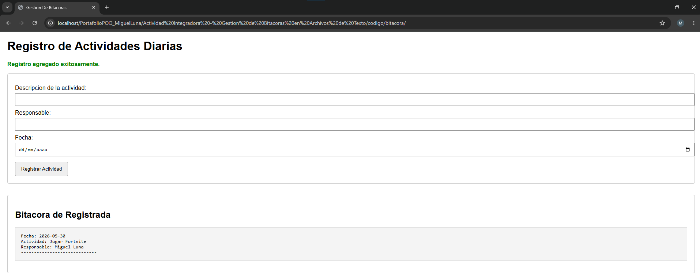

# Gestión de Bitácoras en Archivos de Texto — PHP

> **Asignatura:** Programación Orientada a Objetos  
> **Instituto:** Instituto Tecnológico Superior de Lerdo  
> **Carrera:** Ingeniería Informática  
> **Tipo de actividad:** Actividad Integradora — Manipulación de Archivos de Texto

---

## 1. Nombre del Proyecto

**Sistema de Gestión de Bitácoras en Archivos de Texto con PHP**

---

## 2. Objetivo del Proyecto

Desarrollar un módulo web en PHP que permita **registrar, almacenar y consultar actividades diarias** en un archivo de texto plano (`bitacora.txt`), aplicando funciones nativas de manejo de archivos en PHP con buenas prácticas de programación: validación de entradas, sanitización contra inyección de código, escritura en modo append y bloqueo de archivo para escrituras concurrentes.

---

## 3. Problema que Resuelve

Una empresa de seguridad lleva un registro manual en papel de las actividades diarias de su equipo: revisiones, incidentes, tareas completadas y pendientes. El director desea digitalizar este sistema usando archivos de texto plano, sin instalar ni configurar bases de datos.

El sistema resuelve esto permitiendo:

- **Registrar** actividades nuevas desde un formulario web (descripción, responsable y fecha).
- **Preservar** los registros anteriores al agregar nuevos — ninguna entrada se borra.
- **Consultar** la bitácora completa directamente desde el navegador.
- **Protegerse** contra entradas maliciosas con sanitización de datos.
- **Evitar** corrupción de datos con bloqueo de archivo (`LOCK_EX`) durante la escritura.

---

## 4. Tecnologías Utilizadas

| Tecnología | Versión recomendada | Rol |
|---|---|---|
| PHP | 8.x | Lógica de escritura, lectura y validación |
| HTML5 | — | Estructura del formulario |
| CSS3 | — | Estilos visuales integrados en `index.php` |
| Archivo `.txt` | — | Almacenamiento persistente de registros sin base de datos |
| XAMPP | Cualquier versión reciente | Servidor local (Apache + PHP) |
| Apache | Incluido en XAMPP | Servidor web |
| Navegador web | Chrome / Firefox | Interfaz de usuario |

---

## 5. Conceptos Aplicados

| Concepto | Dónde se aplica |
|---|---|
| **`file_put_contents()` con `FILE_APPEND`** | Escribe el nuevo registro al final del archivo sin borrar los anteriores |
| **`LOCK_EX`** | Bloqueo exclusivo del archivo durante la escritura para evitar corrupción por accesos simultáneos |
| **`file_get_contents()`** | Lee todo el contenido de `bitacora.txt` para mostrarlo en pantalla |
| **`file_exists()`** | Verifica si el archivo existe antes de intentar leerlo; si no existe, muestra un mensaje amigable |
| **`htmlspecialchars()`** | Sanitiza las entradas del formulario convirtiendo caracteres especiales (`<`, `>`, `"`) en entidades HTML, previniendo ataques XSS |
| **`trim()`** | Elimina espacios en blanco al inicio y al final de los campos antes de procesarlos |
| **`empty()`** | Valida que ningún campo llegue vacío al procesamiento del servidor |
| **Validación en dos capas** | HTML5 (`required`) en el cliente; `empty()` en el servidor para mayor seguridad |
| **Formato de registro estructurado** | Cada entrada se guarda con un formato fijo de 4 líneas para facilitar la lectura y el parseo futuro |
| **Mensajes de retroalimentación** | Variables `$mensaje` y `$tipo_mensaje` controlan si se muestra un mensaje de éxito o error con estilo CSS diferenciado |
| **`<pre>` para mostrar el archivo** | Preserva el formato original del texto (saltos de línea, espacios) al mostrarlo en el navegador |
| **`$_SERVER["REQUEST_METHOD"]`** | Detecta si el formulario fue enviado antes de intentar procesar los datos POST |

### Formato de cada registro en `bitacora.txt`

```
Fecha: YYYY-MM-DD
Actividad: descripción de la actividad
Responsable: nombre del responsable
-----------------------------
```

Cada registro ocupa exactamente 4 líneas. Al usar `FILE_APPEND`, los nuevos registros se concatenan debajo de los anteriores, nunca los reemplaza.

### Flujo de funcionamiento

```
Usuario llena el formulario (index.php)
        │
        │  POST: descripcion, responsable, fecha
        ▼
  PHP procesa el formulario (mismo index.php)
  ├── Verifica método POST
  ├── Valida que los campos no estén vacíos
  ├── Sanitiza con htmlspecialchars() y trim()
  ├── Construye el string del registro
  ├── file_put_contents($archivo, $registro, FILE_APPEND | LOCK_EX)
  └── Asigna $mensaje de éxito o error
        │
        ▼
  PHP lee el archivo (mismo index.php, sección inferior)
  ├── file_exists($archivo) → true/false
  ├── file_get_contents($archivo) → contenido completo
  └── echo "<pre>" . htmlspecialchars($contenido) . "</pre>"
```

---

## 6. Capturas de Pantalla

### Formulario de registro y bitácora (index.php)



> Formulario con los campos Descripción, Responsable y Fecha. Debajo se muestra la sección "Bitácora de Registrada" con el contenido actual del archivo en un bloque `<pre>`. El mensaje verde "Registro agregado exitosamente." confirma la operación.

**Registro de prueba visible en el navegador:**
```
Fecha: 2026-05-30
Actividad: Jugar Fortnite
Responsable: Miguel Luna
-----------------------------
```

### Archivo `bitacora.txt` generado automáticamente


> El archivo se crea automáticamente en la misma carpeta del proyecto al registrar la primera actividad. No requiere creación manual.

---

## 7. Instrucciones de Ejecución

### Requisitos previos
- Tener instalado **XAMPP** (o cualquier stack con Apache + PHP 8+).

### Pasos

1. **Clonar o descargar el repositorio**
   ```bash
   git clone https://github.com/MigueLunaa007/PortafolioPOO_MiguelLuna.git
   ```
   O descarga el ZIP y extrae la carpeta.

2. **Mover la carpeta a `htdocs`**
   ```
   C:\xampp\htdocs\bitacora-php\
   ```
   *(En Linux/macOS: `/opt/lampp/htdocs/bitacora-php/`)*

3. **Verificar la estructura de archivos**
   ```
   bitacora-php/
   ├── index.php        # Formulario + lógica de escritura + lectura de bitácora
   └── bitacora.txt     # Se crea automáticamente al primer registro
   ```
   > `bitacora.txt` **no necesita existir previamente**. PHP lo crea solo con `file_put_contents()` la primera vez que se registra una actividad.

4. **Verificar permisos de escritura** *(solo en Linux/macOS)*
   ```bash
   chmod 755 /opt/lampp/htdocs/bitacora-php/
   ```
   Apache necesita permiso de escritura en la carpeta para crear y modificar `bitacora.txt`.

5. **Iniciar Apache desde el Panel de Control de XAMPP**
   - Abre XAMPP Control Panel.
   - Haz clic en **Start** junto a **Apache**.

6. **Abrir el sistema en el navegador**
   ```
   http://localhost/bitacora-php/index.php
   ```

7. **Registrar una actividad**
   - Llena los campos **Descripción**, **Responsable** y **Fecha**.
   - Haz clic en **Registrar Actividad**.
   - Aparecerá el mensaje verde "Registro agregado exitosamente." y la bitácora se actualizará inmediatamente debajo del formulario.

8. **Probar la validación**
   - Intenta enviar el formulario con algún campo vacío → aparecerá el mensaje rojo "Error: Todos los campos son obligatorios."
   - Intenta escribir `<script>alert('xss')</script>` en el campo descripción → el texto se guardará y mostrará como texto plano inofensivo gracias a `htmlspecialchars()`.

9. **Ver el archivo generado directamente**
   - Abre `bitacora.txt` desde tu editor de código o desde:
     ```
     C:\xampp\htdocs\bitacora-php\bitacora.txt
     ```

---

## 8. Reflexión Personal

### ¿Qué aprendí?

Aprendí que PHP tiene herramientas muy sencillas para trabajar con archivos de texto sin necesidad de bases de datos. La diferencia entre `file_put_contents()` con y sin `FILE_APPEND` fue el aprendizaje más concreto: sin ese flag, cada registro nuevo borraría toda la bitácora — un error silencioso y destructivo. Con `FILE_APPEND`, el archivo crece de forma acumulativa como un log real.

También entendí por qué `LOCK_EX` no es opcional en un sistema real: si dos usuarios envían el formulario en el mismo milisegundo, sin el bloqueo los datos pueden mezclarse o corromperse en el archivo. Es un problema que no se ve en pruebas locales pero que aparece en producción con múltiples usuarios.

Por último, aplicar `htmlspecialchars()` tanto al guardar como al mostrar el contenido me dejó claro que la seguridad debe pensarse en dos momentos: al **entrada** de los datos y a la **salida** hacia el navegador.

### ¿Qué fue difícil?

Lo más difícil fue entender la doble aplicación de `htmlspecialchars()`: una vez cuando se recibe el dato del formulario (antes de guardarlo en el archivo) y otra vez cuando se lee el archivo para mostrarlo en el `<pre>`. Al principio parecía redundante, pero entendí que son dos capas de protección distintas: la primera evita que código malicioso se guarde en el archivo, y la segunda evita que cualquier caracter especial que pueda estar en el archivo se interprete como HTML al mostrarse.

También fue un detalle importante el orden de las operaciones: primero escribir en el archivo, luego leer. Si el bloque de lectura estuviera antes del de escritura, el formulario recién enviado no aparecería en la bitácora hasta recargar la página.

### ¿Qué mejoraría?

- Agregaría un sistema de **búsqueda por fecha o responsable**, parseando el archivo línea por línea con `file()` para filtrar registros sin cargar todo el contenido.
- Implementaría un botón para **limpiar la bitácora** (con confirmación) que use `file_put_contents($archivo, '')` para vaciar el archivo sin borrarlo.
- Reemplazaría el bloque `<pre>` por una **tabla HTML** parseando cada grupo de 4 líneas como una fila, para una presentación más profesional.
- Agregaría **paginación** para bitácoras con muchos registros, ya que `file_get_contents()` carga todo en memoria — esto puede ser un problema con archivos muy grandes.
- En un entorno multiusuario real, migraría el almacenamiento a **SQLite** como paso intermedio antes de MySQL, manteniendo la simplicidad pero con consultas más potentes.

---

## Respuestas a las Preguntas de Reflexión

**1. ¿Qué ventajas ofrece escribir en archivos de texto cuando no se requiere una base de datos?**  
Son más simples y ligeros. No requieren instalación ni configuración de servidores adicionales. Son portátiles, fáciles de respaldar con solo copiar el archivo, e ideales para prototipos rápidos o registros secuenciales simples como logs de actividad o contadores.

**2. ¿Cuál es la diferencia entre `file_put_contents` con `FILE_APPEND` y sin él?**  
Con `FILE_APPEND`, la función añade los datos nuevos al final del archivo existente, preservando todo lo que ya estaba escrito — comportamiento esencial para una bitácora. Sin este parámetro, la función sobrescribe por completo el archivo en cada llamada, borrando todos los registros anteriores.

**3. ¿Cómo evitarías que usuarios maliciosos escriban código dentro del archivo?**  
Sanitizando las entradas del formulario antes de guardarlas con `htmlspecialchars()` o `strip_tags()`, que convierten caracteres especiales como `<` y `>` en entidades HTML inofensivas. Esto previene ataques XSS donde un atacante podría inyectar scripts que se ejecuten en el navegador de otros usuarios al leer la bitácora.

**4. ¿Qué pasa si dos usuarios escriben simultáneamente en el archivo?**  
Los datos se pueden mezclar, corromperse o uno puede sobreescribir al otro en el mismo milisegundo. Para evitarlo se usa el flag `LOCK_EX` en `file_put_contents()`, que bloquea el archivo en modo exclusivo durante la escritura. Si se usa `fopen()`, se puede lograr lo mismo con `flock($handle, LOCK_EX)`.

**5. ¿Qué diferencia habría si usaras `fopen()`, `fwrite()`, `fclose()`?**  
El proceso sería manual y de más bajo nivel, requiriendo más líneas de código. Sin embargo, ofrecería control granular: leer o escribir archivos muy grandes línea por línea sin cargar todo en memoria RAM, gestionar el cursor de posición dentro del archivo, o usar distintos modos de apertura (`r`, `w`, `a`, `r+`). Para este proyecto `file_put_contents()` es suficiente, pero `fopen()` es necesario en sistemas más complejos.

---

## Conclusiones

**¿Qué sabía?** Sabía hacer formularios HTML y procesar datos POST en PHP con variables básicas.

**¿Qué aprendí?** A usar `file_put_contents()` con `FILE_APPEND | LOCK_EX` para agregar registros sin borrar los anteriores, y la importancia de sanitizar datos tanto al guardar como al mostrar. También aprendí que un archivo `.txt` puede funcionar como base de datos simple para casos de uso específicos.

**¿Qué podría hacer con lo aprendido?** Crear sistemas de logs de errores para aplicaciones web, contadores de visitas persistentes, formularios de encuestas sencillas, o bitácoras de auditoría para sistemas donde no se requiere consulta compleja — todo sin necesidad de instalar ni configurar un gestor de base de datos.

---

## Licencia

Proyecto académico — Instituto Tecnológico Superior de Lerdo. Uso educativo.
