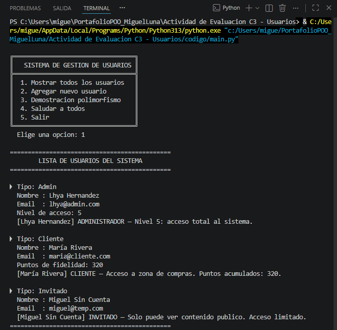
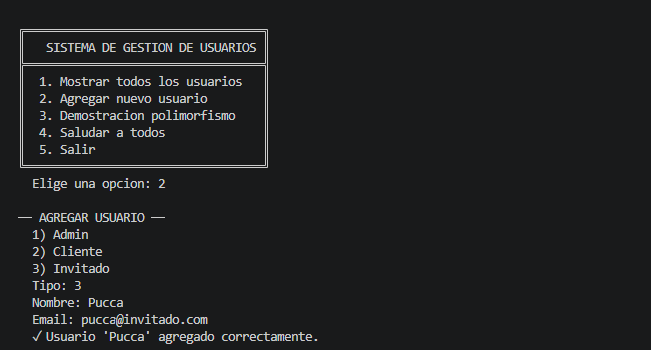
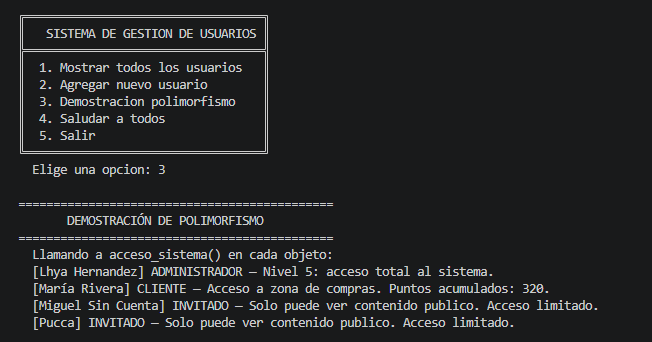
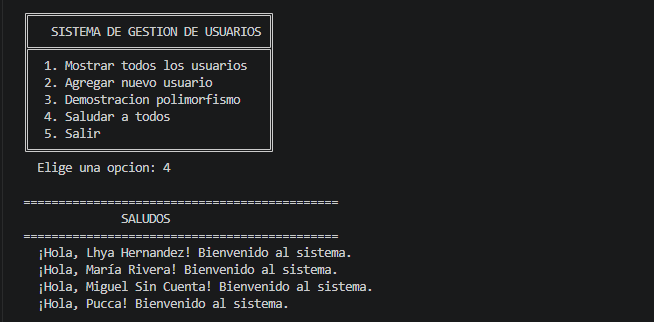
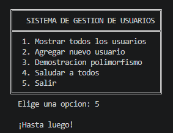

# Sistema de Gestión de Usuarios con Herencia en Python

> **Asignatura:** Programación Orientada a Objetos  
> **Instituto:** Instituto Tecnológico Superior de Lerdo  
> **Carrera:** Ingeniería Informática  
> **Tipo de actividad:** Evaluación ABPj – Corte 3 (Unidad — Herencia y Polimorfismo)

---

## 1. Nombre del Proyecto

**Sistema de Gestión de Usuarios con Herencia en Python**

---

## 2. Objetivo del Proyecto

Aplicar los conceptos de **herencia** y **polimorfismo** en Python construyendo una jerarquía de clases que modele distintos tipos de usuarios de una plataforma digital. La clase base `Usuario` define la estructura común, y las clases derivadas (`Admin`, `Cliente`, `Invitado`) la especializan con atributos y comportamientos propios, reutilizando código mediante `super()`.

---

## 3. Problema que Resuelve

Una plataforma digital necesita controlar el acceso de tres tipos distintos de usuarios:

- **Administradores** — acceso total al sistema con nivel de privilegio configurable.
- **Clientes** — acceso a la zona de compras con puntos de fidelidad acumulados.
- **Invitados** — acceso limitado solo a contenido público.

Todos comparten datos básicos (nombre y email), pero cada tipo tiene permisos y comportamientos diferentes. El sistema permite **crear, registrar y gestionar** estos usuarios desde un menú interactivo en consola, validando los datos de entrada y demostrando polimorfismo en tiempo de ejecución.

---

## 4. Tecnologías Utilizadas

| Tecnología | Versión recomendada | Rol |
|---|---|---|
| Python | 3.8+ | Lenguaje principal |
| Módulo `re` | Incluido en Python | Validación de email con expresiones regulares |
| Terminal / CMD | — | Entorno de ejecución del programa |
| VS Code / PyCharm | Cualquier versión | Editor de código recomendado |

---

## 5. Conceptos Aplicados

| Concepto | Dónde se aplica |
|---|---|
| **Clases y objetos** | `Usuario`, `Admin`, `Cliente`, `Invitado` definidas con `class` e instanciadas con sus constructores |
| **Herencia** | `Admin`, `Cliente` e `Invitado` heredan de `Usuario` usando `class Admin(Usuario)` |
| **Constructor `__init__`** | Cada clase inicializa sus atributos propios; las subclases llaman a `super().__init__()` |
| **`super()`** | Reutiliza el constructor y el método `mostrar_datos()` de la clase padre sin reescribir código |
| **Sobrescritura de métodos** | Las tres subclases sobrescriben `acceso_sistema()` con comportamiento específico |
| **Polimorfismo** | El bucle `for u in usuarios: u.acceso_sistema()` llama al mismo método pero cada objeto responde diferente |
| **Encapsulamiento** | `_validar_email()` es un método privado (convención `_`) de uso interno en `Usuario` |
| **Expresiones regulares** | `re.match(patron, email)` valida el formato del email al crear cualquier usuario |
| **Manejo de excepciones** | `raise ValueError` en `_validar_email()` y bloque `try-except` en `agregar_usuario()` |
| **Listas y estructuras de datos** | La lista global `usuarios[]` almacena objetos de distintas clases |
| **Menú interactivo** | Bucle `while True` con `input()` para navegar por las opciones del sistema |
| **Punto de entrada** | `if __name__ == "__main__": menu()` como buena práctica en Python |

### Jerarquía de herencia

```
        Usuario  (clase base)
       /    |    \
    Admin Cliente Invitado  (clases derivadas)
```

### ¿Qué métodos hereda cada subclase?

| Método | `Usuario` | `Admin` | `Cliente` | `Invitado` |
|---|---|---|---|---|
| `__init__` | Define | Extiende con `nivel_acceso` | Extiende con `puntos` | Reutiliza sin cambios |
| `mostrar_datos()` | Define | Extiende con `super()` | Extiende con `super()` | Hereda sin cambios |
| `acceso_sistema()` | Define (genérico) | Sobrescribe | Sobrescribe | Sobrescribe |
| `saludar()` | Define | Hereda | Hereda | Hereda |
| `_validar_email()` | Define (privado) | Hereda | Hereda | Hereda |

---

## 6. Capturas de Pantalla

 *Captura real de la ejecucion del proyecto en Visual Studio Code.*







### Menú principal (esperado)
```
╔══════════════════════════════════╗
║   SISTEMA DE GESTION DE USUARIOS ║
╠══════════════════════════════════╣
║  1. Mostrar todos los usuarios   ║
║  2. Agregar nuevo usuario        ║
║  3. Demostracion polimorfismo    ║
║  4. Saludar a todos              ║
║  5. Salir                        ║
╚══════════════════════════════════╝
  Elige una opcion:
```

### Opción 1 — Lista de usuarios (esperado)
```
=============================================
        LISTA DE USUARIOS DEL SISTEMA
=============================================

▶ Tipo: Admin
  Nombre : Lhya Hernandez
  Email  : lhya@admin.com
  Nivel de acceso: 5
  [Lhya Hernandez] ADMINISTRADOR — Nivel 5: acceso total al sistema.

▶ Tipo: Cliente
  Nombre : María Rivera
  Email  : maria@cliente.com
  Puntos de fidelidad: 320
  [María Rivera] CLIENTE — Acceso a zona de compras. Puntos acumulados: 320.

▶ Tipo: Invitado
  Nombre : Miguel Sin Cuenta
  Email  : miguel@temp.com
  [Miguel Sin Cuenta] INVITADO — Solo puede ver contenido publico. Acceso limitado.
```

### Opción 3 — Demostración de polimorfismo (esperado)
```
=============================================
       DEMOSTRACIÓN DE POLIMORFISMO
=============================================
  Llamando a acceso_sistema() en cada objeto:
  [Lhya Hernandez] ADMINISTRADOR — Nivel 5: acceso total al sistema.
  [María Rivera] CLIENTE — Acceso a zona de compras. Puntos acumulados: 320.
  [Miguel Sin Cuenta] INVITADO — Solo puede ver contenido publico. Acceso limitado.
```

### Validación de email — error controlado (esperado)
```
── AGREGAR USUARIO ──
  Tipo: 1
  Nombre: Test
  Email: correo-invalido
  ✗ Error: Advertencia: Email invalido: 'correo-invalido'
```

---

## 7. Instrucciones de Ejecución

### Requisitos previos
- Tener instalado **Python 3.8 o superior**.
- Verificar instalación:
  ```bash
  python --version
  ```

### Pasos

1. **Clonar o descargar el repositorio**
   ```bash
   git clone https://github.com/MigueLunaa007/PortafolioPOO_MiguelLuna.git
   cd sistema-usuarios-python
   ```

2. **Verificar la estructura de archivos**
   ```
   sistema-usuarios-python/
   ├── usuario.py       # Clase base
   ├── admin.py         # Clase derivada Admin
   ├── cliente.py       # Clase derivada Cliente
   ├── invitado.py      # Clase derivada Invitado
   └── main.py          # Menú principal y punto de entrada
   ```
   > Todos los archivos deben estar en la **misma carpeta**. Si están separados, las importaciones fallarán.

3. **Ejecutar el programa**
   ```bash
   python main.py
   ```
   *(En algunos sistemas puede ser `python3 main.py`)*

4. **Navegar el menú**
   - Escribe el número de la opción deseada y presiona `Enter`.
   - Para agregar un usuario, sigue las instrucciones en pantalla.
   - Si ingresas un email con formato inválido (sin `@` o sin dominio), el sistema lo rechazará automáticamente.

5. **Probar el polimorfismo**
   - Selecciona la opción `3` para ver cómo la misma llamada `acceso_sistema()` produce salidas distintas según el tipo real de cada objeto.

6. **Salir del programa**
   - Selecciona la opción `5` o presiona `Ctrl + C`.

---

## 8. Reflexión Personal

### ¿Qué aprendí?

Este proyecto fue donde la herencia dejó de ser un concepto abstracto y se convirtió en algo concreto y útil. Entendí que `super()` no es solo una palabra clave; es la forma en que una clase hija le dice a su padre: *"haz lo tuyo, yo solo agrego lo que me falta"*. Eso evita duplicar código y hace que si mañana cambia algo en `Usuario`, todas las clases derivadas reciben esa mejora automáticamente.

También comprendí el polimorfismo de manera muy visual: el mismo bucle `for`, la misma llamada `u.acceso_sistema()`, y tres respuestas completamente distintas según el tipo real del objeto. En un sistema real, eso significa que puedo agregar un cuarto tipo de usuario (por ejemplo, `Moderador`) sin tocar el código del menú — solo creo la nueva clase.

La validación con expresiones regulares (`re`) fue un aprendizaje adicional importante: no siempre se puede confiar en lo que el usuario escribe, y manejar eso desde el constructor garantiza que ningún objeto con datos inválidos llegue a existir en el sistema.

### ¿Qué fue difícil?

Lo más complicado fue entender exactamente **cuándo y cómo usar `super()`** dentro de `mostrar_datos()`. Al principio confundía cuándo llamar al método padre y cuándo sobreescribirlo por completo. El detalle es que si llamas `super().mostrar_datos()` primero, imprimes nombre y email, y luego solo agregas lo extra. Si no lo llamas, tienes que repetir todo ese código manualmente, lo que rompe el propósito de la herencia.

También fue un reto diseñar el menú interactivo para que manejara errores de entrada sin que el programa terminara abruptamente — ahí el bloque `try-except ValueError` fue clave.

### ¿Qué mejoraría?

- Agregaría **persistencia de datos**: guardar y cargar la lista de usuarios desde un archivo `.json` para que no se pierdan al cerrar el programa.
- Implementaría una clase abstracta con `ABC` y `@abstractmethod` para forzar que toda subclase implemente `acceso_sistema()`, haciendo el contrato más explícito.
- Añadiría un método `eliminar_usuario()` y `buscar_usuario(email)` al menú para completar las operaciones CRUD básicas.
- Usaría `dataclasses` de Python para simplificar la definición de atributos en las clases, eliminando código repetitivo del `__init__`.

---

## Respuestas a las Preguntas de la Actividad

**a. ¿Qué ventajas ofrece la herencia en comparación con repetir código?**  
La herencia permite definir atributos y métodos comunes (`nombre`, `email`, `mostrar_datos`, `saludar`) una sola vez en la clase base `Usuario`, y todas las subclases los reciben automáticamente. Si se requiere modificar la validación del email, basta con cambiar `_validar_email()` en `usuario.py` y las tres subclases se actualizan sin tocarlas. Reduce
errores, facilita el mantenimiento y hace el código más legible y escalable. 

**b. ¿Qué métodos fueron heredados?**  
Los métodos `mostrar_datos()`, `acceso_sistema()`, `saludar()` y `_validar_email()` son definidos en Usuario y heredados por `Admin`, `Cliente` e `Invitado`. `Admin` y `Cliente` además los extienden usando `super()` para no perder la lógica del padre; Invitado hereda `saludar()` sin cambios. 

**c. ¿Por qué sobrescribir `acceso_sistema()`?**  
Porque cada tipo de usuario tiene permisos distintos: un `Admin` accede a todo el sistema con su nivel de privilegio, un `Cliente` solo a su zona de compras con sus puntos, y un `Invitado` únicamente al contenido público. Sobrescribir el método permite que cada clase exprese su propio comportamiento sin cambiar la interfaz externa, lo que es la base del polimorfismo.

**d. ¿Qué diferencia existe entre un atributo heredado y uno propio?**  
Los atributos `nombre` y `email` son heredados: se definen en `Usuario` y todos los hijos los poseen automáticamente sin declaración adicional. Los atributos propios (`nivel_acceso` en `Admin`, puntos en `Cliente`) se declaran dentro del constructor de la subclase y solo pertenecen a esa clase; otras clases no los conocen ni los utilizan. 

**e. ¿Qué pasaría si todas las clases estuvieran separadas y no heredaran?**  
Habría que duplicar los atributos `nombre` y `email`, la validación de email y los métodos `mostrar_datos()` y `saludar()` en cada uno de los tres archivos. Cualquier corrección requeriría cambios en múltiples archivos con riesgo de inconsistencias. Además se perdería el polimorfismo: no sería posible recorrer una lista mixta de usuarios con el mismo método `acceso_sistema()`, ya que cada clase sería completamente independiente.

---

## Licencia

Proyecto académico — Instituto Tecnológico Superior de Lerdo. Uso educativo.
