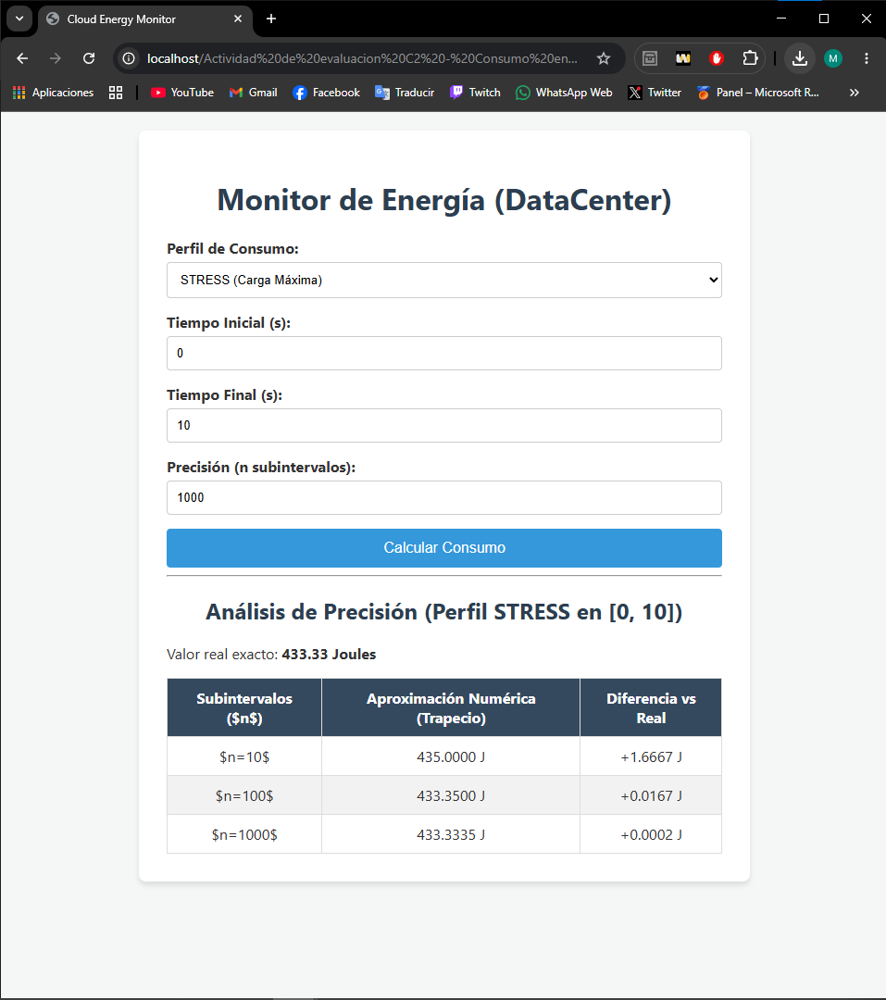
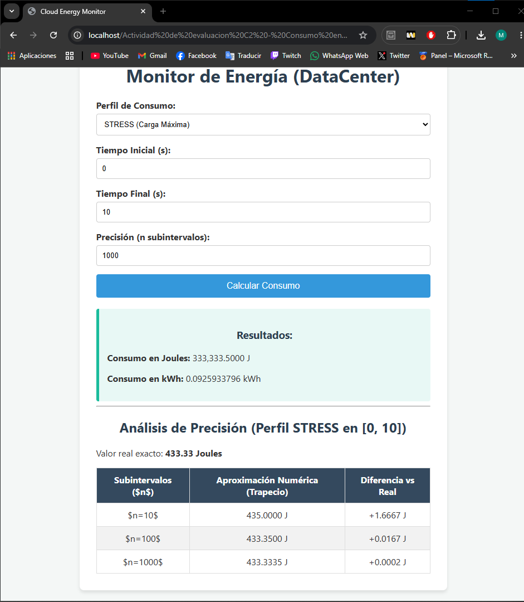
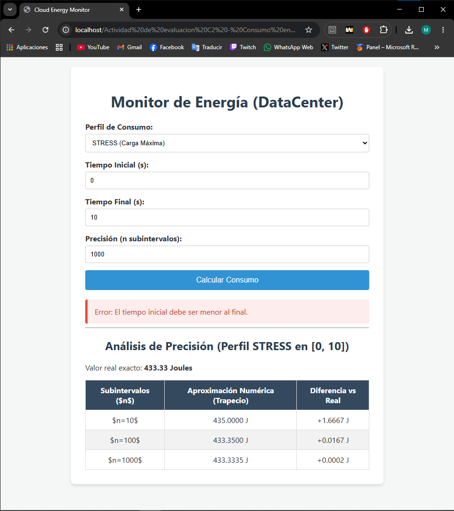

# Cloud Energy Monitor — Analizador de Consumo Energético en Servidores

> **Asignatura:** Programación Orientada a Objetos  
> **Instituto:** Instituto Tecnológico Superior de Lerdo  
> **Carrera:** Ingeniería Informática  
> **Tipo de actividad:** Evaluación ABPj – Corte 2 (Unidad 3 – Métodos)

---

## 1. Nombre del Proyecto

**Cloud Energy Monitor — Analizador de Consumo Energético en Servidores**

---

## 2. Objetivo del Proyecto

Construir una herramienta web profesional que permita a administradores de sistemas calcular la **Energía Total Consumida** por un servidor en un intervalo de tiempo determinado, aplicando integración numérica mediante el **Método del Trapecio** implementado con Programación Orientada a Objetos en PHP.

La energía se obtiene como la integral definida de la función de potencia P(t):

```
Energía = ∫[a → b] P(t) dt
```

Los resultados se presentan tanto en **Joules** como en **Kilovatios-hora (kWh)**.

---

## 3. Problema que Resuelve

En un **Data Center**, el consumo de energía de un servidor varía constantemente según la carga de la CPU. Para facturar correctamente a clientes de la nube (como AWS o Google Cloud) o para calcular la huella de carbono, es necesario conocer la energía exacta consumida en un período de tiempo.

Este proyecto resuelve ese problema permitiendo:

- Seleccionar un **perfil de consumo** que modela el comportamiento real del servidor (`IDLE`, `AVERAGE`, `STRESS`).
- Configurar el **intervalo de tiempo** y la **precisión** del cálculo.
- Obtener el resultado en **Joules** y en **kWh** usando integración numérica.
- Visualizar una **tabla comparativa** que demuestra cómo aumentar los subintervalos reduce el error de aproximación.

---

## 4. Tecnologías Utilizadas

| Tecnología | Versión recomendada | Rol |
|---|---|---|
| PHP | 8.x | Lógica de negocio y cálculo numérico |
| HTML5 | — | Estructura de la interfaz web |
| CSS3 | — | Estilos y diseño visual |
| XAMPP | Cualquier versión reciente | Servidor local (Apache + PHP) |
| Apache | Incluido en XAMPP | Servidor web |
| Navegador web | Chrome / Firefox | Visualización e interacción |

---

## 5. Conceptos Aplicados

| Concepto | Dónde se aplica |
|---|---|
| **Namespaces** | `namespace App\Calculo` en `IntegradorNumerico.php` para organizar clases y evitar colisiones de nombres |
| **Clases y objetos** | La clase `IntegradorNumerico` es instanciada en `index.php` con `new` |
| **Encapsulamiento** | Las propiedades `$inicio`, `$fin`, `$pasos` y `$perfil` son `private`; no son accesibles desde fuera |
| **Métodos públicos y privados** | `funcionPotencia()` es privada (lógica interna); `calcularEnergiaTotal()` y `calcularEnergiaKWh()` son la interfaz pública |
| **Constructor con parámetros** | `__construct(float $a, float $b, int $n, string $perfil)` inicializa el objeto con validación |
| **Manejo de excepciones** | `throw new Exception(...)` y bloque `try-catch` en `index.php` para validar entradas del usuario |
| **Estructuras de control** | `switch` dentro de `funcionPotencia()` para seleccionar el perfil de consumo |
| **Abstracción** | `index.php` no conoce la lógica matemática; solo le pasa parámetros al objeto y recibe resultados |
| **Tipado estricto** | Todas las propiedades y parámetros usan tipos (`float`, `int`, `string`) |
| **`require_once` y `use`** | Importación del archivo de clase y su namespace en `index.php` |
| **Integración numérica** | Método del Trapecio implementado en el bucle `for` de `calcularEnergiaTotal()` |
| **CSS externo** | Archivo separado `css/style.css` vinculado desde `index.php` |

### ¿Qué hace el bucle `for`? — Regla del Trapecio

El área bajo la curva P(t) se aproxima dividiendo el intervalo [a, b] en `n` subintervalos de ancho `h = (b - a) / n` y sumando los trapecios:

```
Energía ≈ h × [ (P(a) + P(b)) / 2 + P(t₁) + P(t₂) + ... + P(tₙ₋₁) ]
```

A mayor `n`, menor error, pero mayor costo computacional — equilibrio fundamental en Informática.

### Perfiles de consumo disponibles

| Perfil | Función P(t) | Descripción |
|---|---|---|
| `IDLE` | P(t) = 5 | Servidor inactivo, consumo constante |
| `AVERAGE` | P(t) = 2t + 5 | Carga creciente promedio |
| `STRESS` | P(t) = t² | Carga máxima (crecimiento cuadrático) |

---

## 6. Capturas de Pantalla

 *Captura real de la ejecucion del proyecto en el navegador.*





### Estructura del proyecto
```
monitor_energetico/
├── src/
│   └── Calculo/
│       └── IntegradorNumerico.php   # Clase lógica (cálculo numérico)
├── css/
│   └── style.css                    # Diseño de la interfaz
└── index.php                        # Formulario + resultados + tabla
```

### Formulario de entrada (esperado)
```
Perfil de Consumo:    [ STRESS (Carga Máxima) ▼ ]
Tiempo Inicial (s):   [ 0                       ]
Tiempo Final (s):     [ 10                      ]
Precisión (n):        [ 1000                    ]
                      [ Calcular Consumo         ]
```

### Resultado esperado (perfil STRESS, intervalo [0,10], n=1000)
```
Resultados:
   Consumo en Joules:  433.3335 J
   Consumo en kWh:     0.0001204 kWh
```

### Tabla comparativa de precisión — perfil STRESS en [0, 10]

| Subintervalos (n) | Aproximación Numérica (Trapecio) | Diferencia vs Real (433.33 J) |
|---|---|---|
| n = 10 | 435.0000 J | +1.6667 J |
| n = 100 | 433.3500 J | +0.0167 J |
| n = 1000 | 433.3335 J | +0.0002 J |

> La tabla demuestra que a mayor `n`, el error de aproximación se reduce significativamente, acercándose al valor real exacto de **433.33 J**.

---

## 7. Instrucciones de Ejecución

### Requisitos previos
- **XAMPP** instalado (o cualquier stack con Apache + PHP 8+).

### Pasos

1. **Clonar o descargar el repositorio**
   ```bash
   git clone https://github.com/MigueLunaa007/PortafolioPOO_MiguelLuna.git
   ```
   O descarga el ZIP y extrae la carpeta.

2. **Mover la carpeta a `htdocs`**
   ```
   C:\xampp\htdocs\monitor_energetico\
   ```
   *(En Linux/macOS: `/opt/lampp/htdocs/monitor_energetico/`)*

3. **Verificar la estructura de carpetas**
   Asegúrate de que el archivo `IntegradorNumerico.php` esté en la ruta exacta:
   ```
   monitor_energetico/src/Calculo/IntegradorNumerico.php
   ```

4. **Iniciar Apache desde el Panel de Control de XAMPP**
   - Abre XAMPP Control Panel.
   - Haz clic en **Start** junto a **Apache**.

5. **Abrir el proyecto en el navegador**
   ```
   http://localhost/monitor_energetico/index.php
   ```

6. **Usar la herramienta**
   - Selecciona un **Perfil de Consumo** (IDLE, AVERAGE o STRESS).
   - Ingresa el **Tiempo Inicial** y **Tiempo Final** en segundos.
   - Define la **Precisión** (número de subintervalos `n`).
   - Haz clic en **Calcular Consumo** y observa los resultados en Joules y kWh.

7. **Probar el manejo de errores**
   - Ingresa un tiempo inicial **mayor** al tiempo final → el sistema mostrará el mensaje de error controlado por el bloque `try-catch`.
   - Ingresa `n = 0` → se activará la segunda validación de excepciones.

---

## 8. Reflexión Personal

### ¿Qué aprendí?

Este proyecto fue donde entendí por primera vez para qué sirven realmente los **Namespaces** en PHP: no son solo una formalidad, sino una forma de organizar el código de manera profesional y evitar que dos clases con el mismo nombre entren en conflicto, igual que en frameworks reales como Laravel. También comprendí la diferencia entre **abstracción** y **encapsulamiento** de una manera práctica: el `index.php` no sabe nada de integrales ni de trapecios, solo sabe que si le da números a la clase, recibe un resultado. Eso es abstracción real.

Otro aprendizaje importante fue el **Método del Trapecio**: entender que lo que parece una operación matemática compleja se puede implementar con un simple bucle `for`, y que aumentar `n` mejora la precisión pero tiene un costo computacional, fue una conexión muy directa entre matemáticas e informática.

### ¿Qué fue difícil?

Lo más complicado fue entender la sintaxis de `namespace` y `use` correctamente. Al principio no entendía por qué en `index.php` se necesita tanto el `require_once` como el `use`: uno incluye el archivo físico y el otro le dice a PHP cómo resolver el nombre de la clase dentro de ese namespace. Confundirlos provoca errores que no son muy claros al principio.

También fue retador diseñar el `switch` de perfiles de manera limpia, ya que cada perfil tiene una función matemática distinta y tenía que asegurarme de que el tipo de retorno siempre fuera `float` para no romper el cálculo del trapecio.

### ¿Qué mejoraría?

- Agregaría una **gráfica dinámica** (usando Chart.js o similar) que dibuje la curva de P(t) sobre el intervalo seleccionado y sombree el área calculada, haciendo el resultado más visual e intuitivo.
- Implementaría **más métodos de integración** (Método de Simpson, por ejemplo) para que el usuario pudiera comparar la precisión entre técnicas.
- Añadiría un método **`getResumen()`** que devuelva un array con todos los resultados formateados, separando aún más la lógica de la presentación y respetando mejor el principio de responsabilidad única.
- Exploraría el uso de **Composer con autoload PSR-4** para eliminar los `require_once` manuales y hacer el proyecto más escalable y profesional.
- Añadiría **pruebas unitarias** con PHPUnit para verificar que `calcularEnergiaTotal()` devuelve el valor esperado para casos conocidos.

---

### Pregunta de Reflexión (de la actividad)

> **¿Por qué es más eficiente calcular una integral numéricamente (con POO) que intentar resolverla simbólicamente en software que procesa millones de datos?**

Porque la integración simbólica requiere manipular expresiones algebraicas completas, lo cual es computacionalmente costoso e incluso imposible para funciones irregulares (como los datos reales de sensores). La integración numérica, en cambio, solo evalúa la función en puntos discretos y suma — operaciones simples que cualquier CPU ejecuta en microsegundos. Encapsulado en una clase, este proceso es además reutilizable, escalable y modificable sin tocar la interfaz, lo que lo hace ideal para sistemas de facturación en tiempo real como AWS o Google Cloud.

---

## Licencia

Proyecto académico — Instituto Tecnológico Superior de Lerdo. Uso educativo.
