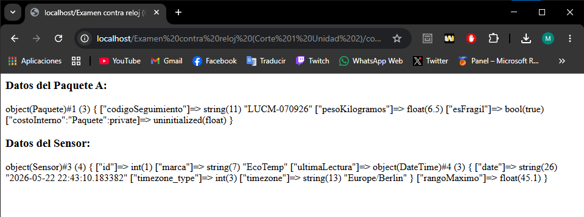

# Examen Práctico – Modelado de Datos con POO en PHP

> **Asignatura:** Programación Orientada a Objetos  
> **Instituto:** Instituto Tecnológico Superior de Lerdo  
> **Carrera:** Ingeniería Informática  
> **Tipo de actividad:** Examen práctico contra reloj (30 minutos)

---

## 1. Nombre del Proyecto

**Sistema de Modelado de Datos con Clases PHP — FastDelivery & Monitor de Plantas**

---

## 2. Objetivo del Proyecto

Demostrar precisión técnica en la sintaxis de PHP orientado a objetos, aplicando el modelado de datos mediante clases con propiedades tipadas, sin el uso de métodos. El examen valora la capacidad de estructurar correctamente las entidades del mundo real como clases reutilizables.

---

## 3. Problema que Resuelve

El proyecto aborda dos escenarios reales:

- **FastDelivery** necesita un molde (clase) para representar sus paquetes logísticos, con datos como código de seguimiento, peso y fragilidad, protegiendo además el costo interno del paquete del acceso externo.
- **Sistema de monitoreo de plantas** requiere representar sensores con datos de identificación, marca, rango de operación y la fecha/hora de su última lectura.

Ambos escenarios ilustran cómo la POO permite encapsular y organizar la información del negocio de forma clara y segura.

---

## 4. Tecnologías Utilizadas

| Tecnología | Versión recomendada | Rol |
|---|---|---|
| PHP | 8.x | Lenguaje principal |
| XAMPP | Cualquier versión reciente | Servidor local (Apache + PHP) |
| Apache | Incluido en XAMPP | Servidor web |
| Navegador web | Chrome / Firefox | Visualización de resultados |

---

## 5. Conceptos Aplicados

- **Clases y objetos** — Definición de `class` y creación de instancias con `new`.
- **Propiedades tipadas** — Uso de tipado estricto en PHP (`string`, `float`, `bool`, `int`, `DateTime`).
- **Modificadores de acceso** — Diferencia entre `public` y `private`.
- **Encapsulamiento** — La propiedad `$costoInterno` es privada; intentar acceder a ella desde fuera de la clase genera un `Fatal Error`.
- **Clases predefinidas de PHP** — Uso de `DateTime` como tipo de dato para `$ultimaLectura`.
- **Importación de archivos** — Uso de `require_once` para separar la lógica en archivos independientes.
- **Instanciación múltiple** — Creación de dos objetos distintos (`$paqueteA` y `$paqueteB`) de la misma clase.
- **`var_dump()`** — Inspección y visualización del estado completo de un objeto en tiempo de ejecución.

---

## 6. Capturas de Pantalla

> Las siguientes capturas muestran el resultado de ejecutar `index.php` en el navegador.

### Estructura del proyecto
```
raíz/
└── src/
    └── Logistica/
        ├── index.php
        ├── Paquete.php
        └── Sensor.php
```

### Salida esperada en el navegador

**Datos del Paquete A:**
```
object(Paquete)#1 (4) {
  ["codigoSeguimiento"] => string(11) "LUCM-070926"
  ["pesoKilogramos"]    => float(6.5)
  ["esFragil"]          => bool(true)
  ["costoInterno":"Paquete":private] => uninitialized(float)
}
```

**Datos del Sensor:**
```
object(Sensor)#2 (4) {
  ["id"]            => int(1)
  ["marca"]         => string(7) "EcoTemp"
  ["ultimaLectura"] => object(DateTime)#3 (3) { ... }
  ["rangoMaximo"]   => float(45.1)
}
```

 *Captura real de la ejecucion del proyecto en el navegador.*


---

## 7. Instrucciones de Ejecución

### Requisitos previos
- Tener instalado **XAMPP** (o cualquier stack con Apache + PHP 8+).

### Pasos

1. **Clonar o copiar el proyecto**
   ```bash
   git clone [https://github.com/MigueLunaa007/PortafolioPOO_MiguelLuna.git]
   ```
   O descarga el ZIP y extrae la carpeta.

2. **Mover la carpeta a `htdocs`**
   ```
   C:\xampp\htdocs\examen-poo\
   ```
   *(En Linux/macOS: `/opt/lampp/htdocs/examen-poo/`)*

3. **Iniciar Apache desde el Panel de Control de XAMPP**
   - Abre XAMPP Control Panel.
   - Haz clic en **Start** junto a **Apache**.

4. **Abrir el proyecto en el navegador**
   ```
   http://localhost/examen-poo/index.php
   ```

5. **Verificar la salida**
   - Deberías ver los datos del `$paqueteA` y del `$sensor` mostrados con `var_dump()`.
   - Si intentas descomentar la línea `$paqueteA->costoInterno = 100.50;`, PHP lanzará un **Fatal Error** por acceso a propiedad privada.

---

## 8. Reflexión Personal

### ¿Qué aprendí?

Aprendí a estructurar clases en PHP aplicando tipado estricto en las propiedades, algo que me parece muy útil para prevenir errores en tiempo de ejecución. También entendí de forma práctica la diferencia entre `public` y `private`: no es solo una regla teórica, sino algo que PHP impone con un error real si se viola. Además, descubrí que PHP cuenta con clases predefinidas como `DateTime`, lo que muestra que el lenguaje ya tiene herramientas poderosas integradas.

### ¿Qué fue difícil?

El mayor reto fue recordar la sintaxis exacta bajo la presión del tiempo. En especial, asegurarme de usar los tipos correctos en cada propiedad (`bool` vs `boolean`, `float` vs `double`) y respetar las rutas de importación con `require_once`. También fue un detalle importante entender por qué la propiedad privada aparece en el `var_dump()` con la anotación `"costoInterno":"Paquete":private`, lo cual al inicio puede confundir.

### ¿Qué mejoraría?

- Agregaría **constructores** (`__construct`) para inicializar los objetos con sus valores desde la creación, haciendo el código más limpio.
- Implementaría **getters y setters** para acceder de forma controlada a la propiedad `$costoInterno`, respetando el principio de encapsulamiento.
- Organizaría mejor las carpetas siguiendo el estándar **PSR-4** para autoloading de clases en PHP moderno.
- Añadiría un archivo `.htaccess` o un `composer.json` para un proyecto más profesional y fácilmente desplegable.

---

## Licencia

Proyecto académico — Instituto Tecnológico Superior de Lerdo. Uso educativo.
